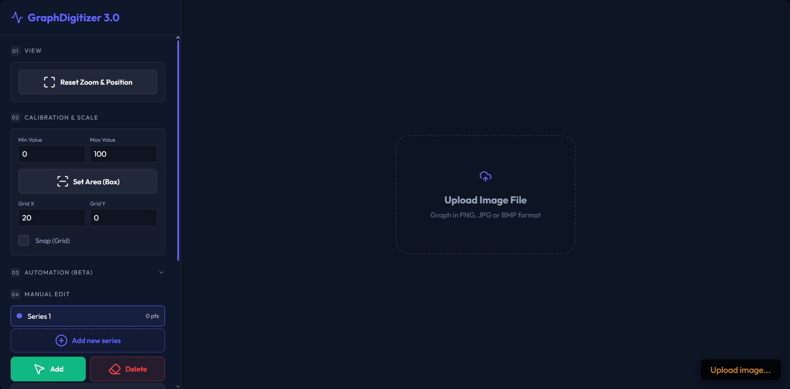

# GraphDigitizer - 3.0 User Manual

## [GraphDigitizer - try online version](https://wowkdigital.github.io/GraphDigitizer/) 

GraphDigitizer 3.0 is a web-based tool designed to extract numerical data points from image-based graphs (PNG, JPG, BMP). It supports manual digitization, automated color-based line detection, and data optimization.

---

## 1. Getting Started

* **Upload an Image:** Drag and drop your graph image into the center "Drop Zone" or click the zone to select a file from your computer.
* **Navigation:**
    * **Zoom:** Use the mouse wheel to zoom in and out.
    * **Pan:** Right-click and drag to move the image around the canvas.
    * **Reset View:** Click **Reset Zoom & Position** in the sidebar to return to the default view.

---

## 2. Calibration (Essential Step)

To get accurate numerical data, you must define the coordinate system:

1.  **Set Y-Axis Range:** Enter the **Min Value** (bottom of the graph) and **Max Value** (top of the graph) in the calibration section.
2.  **Define Area (Box):** Click **Set Area (Box)** and draw a rectangle on the graph that covers the plot area corresponding to your Min/Max values.
3.  **Grid & Snapping:**
    * Enter **Grid X/Y** values to visualize a reference grid.
    * Enable **Snap (Grid)** to force manually placed points to align with these grid lines.

---

## 3. Manual Digitization

* **Add Points:** Ensure the **Add mode** (green button) is active. Click anywhere within the calibration box to place a point. Points are automatically sorted by their X-coordinate.
* **Delete Points:** Switch to **Delete mode** (red button). Hover over a point until it highlights, then click to remove it.
* **Undo:** Press `Ctrl + Z` or click the **Undo** button to revert your last action.

---

## 4. Automation (Beta)

Automated detection is useful for continuous lines of a specific color:

* **Pick Color:** Click **Pick Graph Color**, then click the line on the graph you wish to digitize.
* **Adjust Settings:**
    * **Color Tolerance:** Increase if the line isn't being fully captured; decrease if "noise" or background elements are being picked up.
    * **Simplification (RDP):** Adjusts how many points are generated. Higher values result in fewer points.
    * **Live Preview:** When enabled, white dashed lines will show you the detected path before you commit.
* **Detect Line:** Click this to add the detected points to your active series.

---

## 5. Datasets & Optimization

* **Multiple Series:** Click **Add new series** to digitize different lines on the same graph. You can switch between series by clicking them in the list.
* **Simplification:** In the **Series Optimization** section, use the **Epsilon** slider and click **Simplify active series** to reduce the number of points while maintaining the line's shape.
* **Interpolation:** Use **Interpolate gaps** to automatically fill in missing data points between large horizontal gaps based on the **Max gap px** setting.

---

## 6. Exporting Data

* **Preview:** Click **Download Data** to open the export window.
* **Format:** The data is presented as comma-separated Y-values. Each row represents a different data series.
* **Save:**
    * **Copy to clipboard:** For pasting directly into Excel or Google Sheets.
    * **Download .CSV:** Saves the data as a spreadsheet-ready file.

---

## 7. Controls Summary

| Action | Command |
| :--- | :--- |
| **Place Point** | Left-Click (Add Mode) |
| **Remove Point** | Left-Click (Delete Mode) |
| **Pan Image** | Right-Click + Drag |
| **Zoom** | Mouse Wheel |
| **Undo** | `Ctrl + Z` |
| **Reset All** | Upload New Image button |
